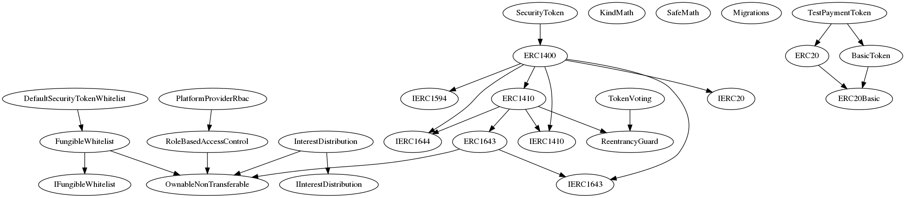

<!-- This file is autogenerated. DO NOT EDIT. -->

# iFunded Audit


* [1 Summary](#1-summary)
  * [1.1 Audit Dashboard](#11-audit-dashboard)
  * [1.2 Audit Goals](#12-audit-goals)
  * [1.3 System Overview](#13-system-overview)
  * [1.4 Key Observations/Recommendations](#14-key-observationsrecommendations)
* [2 Issue Overview](#2-issue-overview)
* [3 Issue Details](#3-issue-details)
  * [3.1 InterestDistribution - `validateInterestPayment\[...\]` functions do not provide additional security](#31-interestdistribution---validateinterestpayment-functions-do-not-provide-additional-security)
  * [3.2 ERC1410 - methods should be public instead of external](#32-erc1410---methods-should-be-public-instead-of-external)
  * [3.3 InterestDistribution - `Level2` role&#x27;s access to funds is equivalent to `owner`](#33-interestdistribution---level2-roles-access-to-funds-is-equivalent-to-owner)
  * [3.4 TokenVoting - cannot hide selected option on blockchain](#34-tokenvoting---cannot-hide-selected-option-on-blockchain)
  * [3.5 TokenVoting - consider using a custom struct type to manage votes](#35-tokenvoting---consider-using-a-custom-struct-type-to-manage-votes)
  * [3.6 ERC1643 getAllDocuments - can be cause gas or memory issues if used](#36-erc1643-getalldocuments---can-be-cause-gas-or-memory-issues-if-used)
  * [3.7 ERC1410 - `_appIdentifier` is never used](#37-erc1410---_appidentifier-is-never-used)
  * [3.8 ERC1410 - events are redefined in the implementation](#38-erc1410---events-are-redefined-in-the-implementation)
  * [3.9 isWhitelistOperator - should be removed from FungibleWhitelist](#39-iswhitelistoperator---should-be-removed-from-fungiblewhitelist)
  * [3.10 RoleBasedAccessControl - redundant input validation](#310-rolebasedaccesscontrol---redundant-input-validation)
  * [3.11 Require latest Solidity version](#311-require-latest-solidity-version)
  * [3.12 ERC1410 - operator variable is used only once](#312-erc1410---operator-variable-is-used-only-once)
  * [3.13 TokenVoting - does not emit event when voting is closed](#313-tokenvoting---does-not-emit-event-when-voting-is-closed)
  * [3.14 TokenVoting - does not have a clear permissions schema](#314-tokenvoting---does-not-have-a-clear-permissions-schema)
  * [3.15 TokenVoting - controllableTokenOnly() checks isControllable() twice](#315-tokenvoting---controllabletokenonly-checks-iscontrollable-twice)
  * [3.16 PlatformProviderRoleAccess - security level denotes hierarchy](#316-platformproviderroleaccess---security-level-denotes-hierarchy)
  * [3.17 PlatformProviderRbac - descriptive names for roles `SECURITY_LEVEL1` and `SECURITY_LEVEL2`](#317-platformproviderrbac---descriptive-names-for-roles-security_level1-and-security_level2)
  * [3.18 FungibleWhitelist - `onlyWhitelistOperator` does not need `msg.sender` argument](#318-fungiblewhitelist---onlywhitelistoperator-does-not-need-msgsender-argument)
  * [3.19 PlatformProviderRbac - function visibility can be external](#319-platformproviderrbac---function-visibility-can-be-external)
  * [3.20 RoleBasedAccessControl - should emit events for critical operations and log `msg.sender`](#320-rolebasedaccesscontrol---should-emit-events-for-critical-operations-and-log-msgsender)
  * [3.21 InterestDistribution - Redundant input validation](#321-interestdistribution---redundant-input-validation)
  * [3.22 RoleBasedAccessControl - missing input validation for `asset`](#322-rolebasedaccesscontrol---missing-input-validation-for-asset)
  * [3.23 OwnableNonTransferable - should emit an event when setting the owner](#323-ownablenontransferable---should-emit-an-event-when-setting-the-owner)
  * [3.24 OwnableNonTransferable - redundant `onlyContractOwner`](#324-ownablenontransferable---redundant-onlycontractowner)
* [4 Threat Model](#4-threat-model)
  * [4.1 Overview](#41-overview)
* [5 Tool-Based Analysis](#5-tool-based-analysis)
  * [5.1 Mythril](#51-mythril)
  * [5.2 Ethlint](#52-ethlint)
  * [5.3 Surya](#53-surya)
* [6 Test Coverage Measurement](#6-test-coverage-measurement)
* [7 Appendix - File Hashes](#7-appendix---file-hashes)
* [Appendix 1  - Severity](#appendix-1----severity)
  * [A.1.2 - Minor](#a12---minor)
  * [A.1.3 - Medium](#a13---medium)
  * [A.1.4 - Major](#a14---major)
  * [A.1.5 - Critical](#a15---critical)
* [Appendix 2  - Disclosure](#appendix-2----disclosure)


## 1 Summary

ConsenSys Diligence conducted a security audit on the security token standard implemented by iEstate GmbH, as well as the voting system, interest distribution and the whitelist management.

### 1.1 Audit Dashboard
________________

#### Audit Details

* **Project Name: iFunded**
* **Client Name: iEstate GmbH**
* **Client Website: https://iestate.de/**
* **Client Contact: Greg Freeman**
* **Lead Auditor: Daniel Luca**
* **Co-auditors: John Mardlin, Steve Marx, Martin Ortner**
* **Date: 29 April 2019**
* **Commit hash: 55cde0edba01488d99ac84a42b8e36f4ed8cdae3**

#### Number of issues by severity

| | **Minor** | **Medium** | **Major** | **Critical** |
|:-------------:|:-------------:|:-------------:|:-------------:|:-------------:|
| **Open** | **0** | **0** | **0** | **0** |
| **Closed** | **14** | **10** | **0** | **0** |

________________

### 1.2 Audit Goals

The focus of the audit was to verify that the smart contract system is secure, resilient and working according to its specifications. The audit activities can be grouped in the following three categories:

**Security:** Identifying security related issues within each contract and within the system of contracts.

**Sound Architecture:** Evaluation of the architecture of this system through the lens of established smart contract best practices and general software best practices.

**Code Correctness and Quality:** A full review of the contract source code. The primary areas of focus include:

* Correctness
* Readability
* Sections of code with high complexity
* Improving scalability
* Quantity and quality of test coverage

### 1.3 System Overview

#### Documentation

The following documentation was available to the audit team:

- Security Token Platform Technical Overview [private document]
- Assumptions for the audit [private document]

#### Detail

Top level contracts and libraries: 

- SecurityToken
- TokenVoting
- PlatformProviderRbac
- DefaultSecurityTokenWhitelist
- InterestDistribution
- SafeMath
- KindMath



#### Scope

The scope of the audit was defined as the Solidity code in the `./contracts/` folder except for `TestPaymentToken` and `Migrations`.

The list of files and their hashes can be found in [Appendix - File Hashes](#7-appendix---file-hashes).

#### Design

The whole system is built around 4 major contracts:

- **DefaultSecurityTokenWhitelist**

  The operator grants permission to investors to interact with the security tokens. They can be added or removed from the approved list. Whenever an investor is added to the list, a cryptographic hash is pinned in the smart contract state which represents the investor's verified information.

- **TokenVoting**

  Implements partition based voting functionality. Actors can propose votes for a partition, with arbitrary voting options and they specify who can vote on the topic. Each vote is pinned to an Ethereum block number. The voters have the same weight when they vote, each actor's vote counts as 1. The on chain functionality does not define a weight attached to the amount of ether or tokens they own, however off chain a vote weighting can be done if needed. The smart contract can be used as proof for the option each voter has selected.

- **SecurityToken**

  This is the main part of the application which implements the [ERC 1400](https://github.com/ethereum/EIPs/issues/1400) also known as [Security Token Standard](https://thesecuritytokenstandard.org/). It is a group of standards that aim to create a representation of securities on the Ethereum blockchain. It is comprised of:
  - [ERC 1410 - Partially Fungible Token Standard](https://github.com/ethereum/EIPs/issues/1410)
  - [ERC 1594 - Core Security Token Standard](https://github.com/ethereum/EIPs/issues/1594)
  - [ERC 1643 - Document Management Standard](https://github.com/ethereum/EIPs/issues/1643)
  - [ERC 1644 - Controller Token Operation Standard](https://github.com/ethereum/EIPs/issues/1644)

  Is compatible with [ERC 20](https://github.com/ethereum/EIPs/issues/20) and [ERC 777](https://github.com/ethereum/EIPs/issues/777).

- **InterestDistribution**

    The `InterestDistribution` contract can hold ether and other tokens. Ether and other tokens may be deposited, and whitelisted accounts may specify the amount of tokens which can be claimed by an address.

    Notably, this contract does not reference the state of any Security Tokens, or verify the calculation used to determine the payments. It simply enables the operators of the iFunded platform to distribute payments in any amount, to any token, and to any address. This approach avoids the cost of on-chain computation, while enabling the iEstate platform to publish the methodology for calculating payouts based on tokens held at a given time, and for token holders to independently verify the calculations.

### 1.4 Key Observations/Recommendations

Positive observations:

- The design of the system adheres to the reference implementation.
- The methods have comments that describe the functionality and the parameters.
- The Solidity smart contracts are split into multiple files, most of the time being comprised out of an interface and an implementation.
- The arithmetic operations are checked with `KindMath` and are safely finalized with `SafeMath`.
- There is a fair number of tests checking the proper functionality of the application.
- Best practices are followed where they make sense.
- No major issues were found in the code.

Opportunities for improvement:

- Test coverage is incomplete. It is a good practice to have 100% code coverage. In particular it's useful to include negative test cases ensuring that undesirable actions are impossible.  
- There are instances where contracts are split into a large number of files, making the inheritance tree difficult to reason about.
- Both safety and efficiency can be improved by reviewing for the correct use of the keywords  `public` and `external` on functions.
- A glossary of terms could be helpful to people who come from a financial background, as well as blockchain developers trying to understand the securities terminology.
- Code readability can be improved by adopting a consistent formatting scheme, particularly with respect to indentation and whitespace in function declaration. 

## 2 Issue Overview

The following table contains all the issues discovered during the audit. The issues are ordered based on their severity. More detailed description on the levels of severity can be found in the Severity Definitions Appendix. The table also contains the status of any discovered issue.

| Chapter      | Issue Title             | Issue Status | Severity    |
| ------------ | ----------------------- | ------------ | ----------- |
| 3.1  | [InterestDistribution - `validateInterestPayment\[...\]` functions do not provide additional security](#31-interestdistribution---validateinterestpayment-functions-do-not-provide-additional-security) | Closed  | Medium |
| 3.2  | [ERC1410 - methods should be public instead of external](#32-erc1410---methods-should-be-public-instead-of-external) | Closed  | Medium |
| 3.3  | [InterestDistribution - `Level2` role&#x27;s access to funds is equivalent to `owner`](#33-interestdistribution---level2-roles-access-to-funds-is-equivalent-to-owner) | Closed  | Medium |
| 3.4  | [TokenVoting - cannot hide selected option on blockchain](#34-tokenvoting---cannot-hide-selected-option-on-blockchain) | Closed  | Medium |
| 3.5  | [TokenVoting - consider using a custom struct type to manage votes](#35-tokenvoting---consider-using-a-custom-struct-type-to-manage-votes) | Closed  | Medium |
| 3.6  | [ERC1643 getAllDocuments - can be cause gas or memory issues if used](#36-erc1643-getalldocuments---can-be-cause-gas-or-memory-issues-if-used) | Closed  | Medium |
| 3.7  | [ERC1410 - `_appIdentifier` is never used](#37-erc1410---_appidentifier-is-never-used) | Closed  | Medium |
| 3.8  | [ERC1410 - events are redefined in the implementation](#38-erc1410---events-are-redefined-in-the-implementation) | Closed  | Medium |
| 3.9  | [isWhitelistOperator - should be removed from FungibleWhitelist](#39-iswhitelistoperator---should-be-removed-from-fungiblewhitelist) | Closed  | Medium |
| 3.10  | [RoleBasedAccessControl - redundant input validation](#310-rolebasedaccesscontrol---redundant-input-validation) | Closed  | Medium |
| 3.11  | [Require latest Solidity version](#311-require-latest-solidity-version) | Closed  | Minor |
| 3.12  | [ERC1410 - operator variable is used only once](#312-erc1410---operator-variable-is-used-only-once) | Closed  | Minor |
| 3.13  | [TokenVoting - does not emit event when voting is closed](#313-tokenvoting---does-not-emit-event-when-voting-is-closed) | Closed  | Minor |
| 3.14  | [TokenVoting - does not have a clear permissions schema](#314-tokenvoting---does-not-have-a-clear-permissions-schema) | Closed  | Minor |
| 3.15  | [TokenVoting - controllableTokenOnly() checks isControllable() twice](#315-tokenvoting---controllabletokenonly-checks-iscontrollable-twice) | Closed  | Minor |
| 3.16  | [PlatformProviderRoleAccess - security level denotes hierarchy](#316-platformproviderroleaccess---security-level-denotes-hierarchy) | Closed  | Minor |
| 3.17  | [PlatformProviderRbac - descriptive names for roles `SECURITY_LEVEL1` and `SECURITY_LEVEL2`](#317-platformproviderrbac---descriptive-names-for-roles-security_level1-and-security_level2) | Closed  | Minor |
| 3.18  | [FungibleWhitelist - `onlyWhitelistOperator` does not need `msg.sender` argument](#318-fungiblewhitelist---onlywhitelistoperator-does-not-need-msgsender-argument) | Closed  | Minor |
| 3.19  | [PlatformProviderRbac - function visibility can be external](#319-platformproviderrbac---function-visibility-can-be-external) | Closed  | Minor |
| 3.20  | [RoleBasedAccessControl - should emit events for critical operations and log `msg.sender`](#320-rolebasedaccesscontrol---should-emit-events-for-critical-operations-and-log-msgsender) | Closed  | Minor |
| 3.21  | [InterestDistribution - Redundant input validation](#321-interestdistribution---redundant-input-validation) | Closed  | Minor |
| 3.22  | [RoleBasedAccessControl - missing input validation for `asset` ](#322-rolebasedaccesscontrol---missing-input-validation-for-asset) | Closed  | Minor |
| 3.23  | [OwnableNonTransferable - should emit an event when setting the owner](#323-ownablenontransferable---should-emit-an-event-when-setting-the-owner) | Closed  | Minor |
| 3.24  | [OwnableNonTransferable - redundant `onlyContractOwner`](#324-ownablenontransferable---redundant-onlycontractowner) | Closed  | Minor |

## 3 Issue Details

### 3.1 InterestDistribution - `validateInterestPayment\[...\]` functions do not provide additional security

| Severity     | Status    | Remediation Comment |
| ------------ | --------- | ------------------- |
| Medium | Closed | This issue is currently under review. |

#### Description

The `validateInterestPaymentinEthers`, and `validateInterestPaymentinTokens` functions do not provide additional security, as they only check that the contract has sufficient balance to make the transfer. This property is already enforced by the token standards (ie. erc-20) and in the EVM when transferring ether.

#### Examples

**code/contracts/InterestDistribution/iEstate/InterestDistribution.sol:L214-L234**
```solidity
    * Validates interest payment of tokens by making sure the contract has enough of the tokens.
    * @param interestPayment It is the amount of tokens.
    * @param interestPaymentToken It is an instance/address of the token contract which is paid as interest payment.
    */
    function validateInterestPaymentinTokens(uint interestPayment, IERC20 interestPaymentToken) private view {
        require(interestPayment > 0, "Interest payment in chosen token has zero balance.");
        require(
            interestPayment <= interestPaymentToken.balanceOf(address(this)),
            "The contract does not have token balance."
        );
    }

    
}
```

#### Remediation

If the purpose of these functions is to provide accurate error messages, they may be kept. Otherwise remove them as they do not provide increased safety.
### 3.2 ERC1410 - methods should be public instead of external

| Severity     | Status    | Remediation Comment |
| ------------ | --------- | ------------------- |
| Medium | Closed | This issue is currently under review. |

#### Description

The methods `isOperator` and `isOperatorForPartition` can be public instead of external because they are also called internally. Usually a method is set as `external` when the contract does not need to call it and an external call should be made to it. If the method is called internally and externally, `public` is most commonly used.

**code/contracts/ERC/ERC1410/ERC1410.sol:L396**
```solidity
function isOperator(address operator, address tokenHolder) external view returns (bool) {
```

**code/contracts/ERC/ERC1410/ERC1410.sol:L407**
```solidity
function isOperatorForPartition(bytes32 partition, address operator, address tokenHolder) external view 
```

When calling a method which is marked as `external`, an external call has to be made:
**code/contracts/ERC/ERC1410/ERC1410.sol:L407**
```solidity
function isOperatorForPartition(bytes32 partition, address operator, address tokenHolder) external view 
```
**code/contracts/ERC/ERC1410/ERC1410.sol:L699-L703**
```solidity
require(
    this.isOperator(msg.sender, tokenHolder) || 
    this.isOperatorForPartition(partition, msg.sender, tokenHolder),
    "Not authorised"
);
```

#### Remediation

Change the visibility of `isOperator` and `isOperatorForPartition` from `external` to `public` and call the functions internally (without prefixing the calls with `this.`).

#### References

- [Official Solidity documentation](https://solidity.readthedocs.io/en/latest/contracts.html#visibility-and-getters)
- [Good explanation of differences between public and external](https://ethereum.stackexchange.com/a/19391/6253)

### 3.3 InterestDistribution - `Level2` role&#x27;s access to funds is equivalent to `owner`

| Severity     | Status    | Remediation Comment |
| ------------ | --------- | ------------------- |
| Medium | Closed | This issue is currently under review. |

#### Description

To explain this issue, we first provide a quick summary of some of the permissions in `InterestDistribution.sol`:

1. ETH or Token balances can be deposited to this address by any account.
2. Payouts can only be set by the role `iEstate STO Platform - Level2` of asset `iEstate STO Platform`  (via `setInterestPaymentforWithdrawals`). There is no restriction on what addresses can be given a payout.
3. Residual ETH or Tokens can only be withdrawn by the `owner` (aka `controller`) of this contract.

Item 3 suggests that the `owner` role is intended to provide additional security when withdrawing a full balance, however item 2 also allows `Level2` to perform a complete withdrawal of all tokens and ETH in the contract by setting a payment to an address they control.

The concern is that there is an expectation of a lower security requirements for private keys which control a `Level2` address, when in fact these keys are just as capable of looting the full balance of the contract.

#### Remediation

Consider merging the 2 roles together. This might mean removing the `owner` role and replacing it with `Level2`.

### 3.4 TokenVoting - cannot hide selected option on blockchain

| Severity     | Status    | Remediation Comment |
| ------------ | --------- | ------------------- |
| Medium | Closed | This issue is currently under review. |

#### Description

The inherent property of blockchain distributed databases is that all of the data is available to anyone. 

The `getVote` method in `TokenVoting`, which returns an address's selected option, assumes a certain possibility to limit the access to that piece of information. Even if the function does not return the option selected, the data is still there and available in unencrypted form to be read by anyone.

**code/contracts/TokenVoting.sol:L298-L322**
```solidity
/**
 * @notice Gets the vote of the address specified.
 * @param securityToken The address of the security token
 * @param partition The partition under debate
 * @param topic The topic under debate
 * @param blockNumber The Ethereum block number (point in time)
 * @param addr The address of the voter
 */
function getVote(
    SecurityToken securityToken,
    bytes32 partition, 
    bytes32 topic, 
    uint256 blockNumber, 
    address addr
    ) public view returns (bytes32) {

    // The address of the security token
    address tokenAddress = address(securityToken);

    // Determine whether the voting results can be revealed or not
    bool canReveal = canRevealResults(securityToken, partition, topic, blockNumber);

    // Do not reveal the vote of this token holder until voting is resolved.
    return canReveal ? _votes[tokenAddress][partition][topic][blockNumber][addr] : ZERO_BYTES32;
}
```

All methods which call `canRevealResults`:
- getVote
- getStats
- getVotes

#### Remediation

There are 2 options to change this based on the privacy constraints you need to enforce:
- **Do not limit access**

  Because the data is there and always accessible, even if not easily available, a suggestion is to remove the checks, because they just waste gas.

```solidity
function getVote(
    SecurityToken securityToken,
    bytes32 partition, 
    bytes32 topic, 
    uint256 blockNumber, 
    address addr
    ) public view returns (bytes32) {

    // The address of the security token
    address tokenAddress = address(securityToken);

    // Do not reveal the vote of this token holder until voting is resolved.
    return _votes[tokenAddress][partition][topic][blockNumber][addr];
}
```

- **Hash the voting option**

  If the voting options need to be hidden at all times until the end of the voting period, the voting process has to be redesigned. The users must submit their voting option as a cryptographic hash. No other votes can be submitted after the voting period has ended and the users have to reveal their option.

#### References

The ENS bidding process uses a sealed bid mechanism that can be an inspiration for the vote hashing implementation.

**contracts/HashRegistrar.sol:L136**
```solidity
bytes32 seal = shaBid(_hash, msg.sender, _value, _salt);
```
### 3.5 TokenVoting - consider using a custom struct type to manage votes

| Severity     | Status    | Remediation Comment |
| ------------ | --------- | ------------------- |
| Medium | Closed | This issue is currently under review. |

#### Description

There are 6 mappings, nested up to a depth of 6, declared in TokenVoting:

**code/contracts/TokenVoting.sol:L33-L49**
```solidity
mapping (address => mapping (bytes32 => mapping (bytes32 => mapping (uint256 => mapping (address => bytes32))))) 
private _votes;

mapping (address => mapping (bytes32 => mapping (bytes32 => mapping (uint256 => mapping (bytes32 => uint256))))) 
private _voteCounts;

mapping (address => mapping (bytes32 => mapping (bytes32 => mapping (uint256 => bytes32[])))) 
private _votingOptions;

mapping (address => mapping (bytes32 => mapping (bytes32 => mapping (uint256 => address[])))) 
private _voters;

mapping (address => mapping (bytes32 => mapping (bytes32 => mapping (uint256 => uint8)))) 
private _state;

mapping (address => mapping (bytes32 => mapping (bytes32 => mapping (uint256 => uint256)))) 
private _votingDeadline;
```

In each of these mappings, the first four keys are always identical during a given function call, leading to highly repetitive code requiring a significant effort to verify that all the keys match. 

The current pattern is also inefficient, as a hash is required for each key provided to lookup or write a value. 

#### Remediation

Consider replacing the code above with a struct:

```solidity
struct VoteData {
        mapping (address => bytes32) _votes;
        mapping (bytes32 => uint256) _voteCounts; // votes on a given option
        bytes32[] _votingOptions;
        address[] _voters;
        uint8 _state;
        uint256 _votingDeadline;
    } 
mapping (address => mapping (bytes32 => mapping (bytes32 => mapping (uint256 => VoteData)))) private _vote;
```

### 3.6 ERC1643 getAllDocuments - can be cause gas or memory issues if used

| Severity     | Status    | Remediation Comment |
| ------------ | --------- | ------------------- |
| Medium | Closed | This issue is currently under review. |

#### Description

The function `getAllDocuments()` can be blocked if too many documents are added. Contracts interacting with it might run out of gas. This can also create problems with other code that relies or tries to read the result value of `getAllDocuments()`.

Because the output is unlimited, this can cause out of gas, memory or execution problems.

This problem can be avoided if there is no code that interacts with this function or the number of documents will always be a low number.

#### Examples

Calling the `getAllDocuments()` function has this gas impact with the specified number of documents:
- 200 documents will use ~100k gas;
- 1000 documents will use ~370k gas;
- 1700 documents will use ~650k gas;
- 5000 documents will use ~2 million gas.

This contract was used to generate the gas costs above:
```solidity
contract Reader {
    ERC1643 public d;
    constructor(ERC1643 _addr) public {
        d = _addr;
    }
    
    uint256 public count;
    
    function readDocs() public returns (uint256) {
        count = d.getAllDocuments().length;
        return count;
    }
}
```

#### Remediation

Because this is part of the standard implementation and the specs, there is no code remediation possible. The advice is to avoid calling the function and only use `getDocument()`.

#### References

- Geth provides `MaxUint64 / 2` gas when calling `view`, or `constant` functions but this was not always the case:

**internal/ethapi/api.go:L740**
```solidity
gas := uint64(math.MaxUint64 / 2)
```

- https://ethereum.stackexchange.com/a/9872

- https://ethereum.stackexchange.com/a/44778/6253

Ganache and Parity have different defaults. Other clients will implement their own defaults.
### 3.7 ERC1410 - `_appIdentifier` is never used

| Severity     | Status    | Remediation Comment |
| ------------ | --------- | ------------------- |
| Medium | Closed | This issue is currently under review. |

#### Description

The `_appIdentifier` is defined here:
**code/contracts/ERC/ERC1410/ERC1410.sol:L37-L38**
```solidity
// The application identifier
bytes32 internal _appIdentifier;
```

It is set in the constructor but it is never used:
**code/contracts/ERC/ERC1410/ERC1410.sol:L110**
```solidity
_appIdentifier = appIdentifier;
```

#### Remediation

Implement a getter or remove `_appIdentifier`.

### 3.8 ERC1410 - events are redefined in the implementation

| Severity     | Status    | Remediation Comment |
| ------------ | --------- | ------------------- |
| Medium | Closed | This issue is currently under review. |

#### Description

The ERC1410 implementation extends the EIP1410 interface which defines the events that can be emitted in the contract. Because the events are already defined in the interface, they do not need to be defined again in the implementation. 

Defining the events again can lead to mistakes, in case the developer defines a similar but not quite exact event, or confusion, because somebody that reads the contract now needs to check if the specified event in the implementation matches the one defined in the interface.

Having the events defined only in one place reduces confusion and possible mistakes, while increasing code maintainability.

#### Examples

The code when emitting the `Boom()` event in each case is very similar but the emitted event might not be the expected one.

```solidity
pragma solidity >0.5.0;

interface MyInterface {
    function explode(bytes calldata _data) external;
    function implode(uint256 _data) external;
    
    event Boom(bytes _data);
}

contract MyImplementation is MyInterface {
    // We define an event with the same name as the one in the interface
    // but a different argument type
    event Boom(uint256 _data); 
    
    /*
    This function emits the MyInterface.Boom(bytes _data) event:
    [
    	{
    		"from": "0xec5bee2dbb67da8757091ad3d9526ba3ed2e2137",
    		"topic": "0xf0525cb4f38ada4b00a047310c294a112a153e48e11a55b7f4b2fe1024405383",
    		"event": "Boom",
    		"args": {
    			"0": "0x1234",
    			"_data": "0x1234",
    			"length": 1
    		}
    	}
    ]
    */
    function explode(bytes memory _data) public {
        emit Boom(_data);
    }
    
    
    /*
    This function emits the MyImplementation.Boom(uint256 _data) event:
    [
    	{
    		"from": "0xec5bee2dbb67da8757091ad3d9526ba3ed2e2137",
    		"topic": "0x1167d8fb28af59d807f1ba2dd442f6a78306131cc03e11970dd6e66c8adc9f57",
    		"event": "Boom",
    		"args": {
    			"0": "4660",
    			"_data": "4660",
    			"length": 1
    		}
    	}
    ]
    */
    function implode(uint256 _data) public {
        emit Boom(_data);        
    }
}
```

#### Remediation

Remove the events which are already defined in the interface.

**code/contracts/ERC/ERC1410/ERC1410.sol:L68-L87**
```solidity
event TransferByPartition(
    bytes32 indexed _fromPartition,
    address _operator,
    address indexed _from,
    address indexed _to,
    uint256 _value,
    bytes _data,
    bytes _operatorData
);

event AuthorizedOperator(address indexed operator, address indexed tokenHolder);
event RevokedOperator(address indexed operator, address indexed tokenHolder);

event AuthorizedOperatorByPartition(
    bytes32 indexed partition, address indexed operator, address indexed tokenHolder
);

event RevokedOperatorByPartition(
    bytes32 indexed partition, address indexed operator, address indexed tokenHolder
);
```
### 3.9 isWhitelistOperator - should be removed from FungibleWhitelist

| Severity     | Status    | Remediation Comment |
| ------------ | --------- | ------------------- |
| Medium | Closed | This issue is currently under review. |

#### Description

The `FungibleWhitelist` contract implements the interface `IFungibleWhitelist`. One of the functions it needs to implement is `isWhitelistOperator`, however this function is only implemented in the contract that inherits `FungibleWhitelist`.

The `FungibleWhitelist` contract does not need to define `isWhitelistOperator`, it is already defined in the interface so this can be removed:

**code/contracts/whitelists/FungibleWhitelist.sol:L115-L122**
```solidity
/**
 * @notice Indicates if the operator specified is allowed to whitelist addresses.
 * Only the owner of the contract is allowed to add/remove operators.
 * @param addr The address of the operator
 * @param asset The asset the operator is allowed to manage
 * @return returns true if the operator specified is allowed to whitelist other addresses.
 */
function isWhitelistOperator(address addr, bytes32 asset) external view returns (bool);
```

#### Remediation

Remove the lines describing the function definition.
### 3.10 RoleBasedAccessControl - redundant input validation

| Severity     | Status    | Remediation Comment |
| ------------ | --------- | ------------------- |
| Medium | Closed | This issue is currently under review. |

#### Description

`addToRole` and `removeFromRole` are both validating the user provided arguments `addr`, `role` and `asset`. However, both functions are internally calling `isMemberOf` which also performs the same and therefore redundant input validation checks.

**code/contracts/access/RoleBasedAccessControl.sol:L93-L97**
```solidity
function addToRole(address addr, bytes32 role, bytes32 asset) public onlySecurityOperator(asset) {
    require(addr != ZERO_ADDRESS, "The address is required.");
    require(role != ZERO_BYTES, "The role is required.");
    require(asset != ZERO_BYTES, "The asset is required.");
    require(!isMemberOf(addr, role, asset), "The address has been added to this role already.");
```

**code/contracts/access/RoleBasedAccessControl.sol:L107-L111**
```solidity
function removeFromRole(address addr, bytes32 role, bytes32 asset) public onlySecurityOperator(asset) {
    require(addr != ZERO_ADDRESS, "The address is required.");
    require(role != ZERO_BYTES, "The role is required.");
    require(asset != ZERO_BYTES, "The asset is required.");
    require(isMemberOf(addr, role, asset), "The address is not a member of this role.");
```

**code/contracts/access/RoleBasedAccessControl.sol:L80-L85**
```solidity
function isMemberOf(address addr, bytes32 role, bytes32 asset) public view returns (bool) {
    require(addr != ZERO_ADDRESS, "The address is required.");
    require(role != ZERO_BYTES, "The role is required.");
    require(asset != ZERO_BYTES, "The asset is required.");
    return _addressRoles[addr][role][asset];
}
```

#### Remediation

Rely on `isMemberOf` to perform input validation in a single place for `addToRole` and `removeFromRole`.

### 3.11 Require latest Solidity version

| Severity     | Status    | Remediation Comment |
| ------------ | --------- | ------------------- |
| Minor | Closed | This issue is currently under review. |

#### Description

Solidity is very active pushing out new versions. Make sure to include the latest stable version that does not break any things.

#### Remediation

At the moment of writing, the latest stable version is [0.5.7](https://github.com/ethereum/solidity/releases/tag/v0.5.7).

It is a good practice to pin to a specific version. Having a floating version can open your application to newer, possibly not well tested, versions.

```solidity
// Fixed version
pragma solidity 0.5.7; 

// As opposed to a floating pragma
pragma solidity ^0.5.7;
```

#### References

https://github.com/ethereum/solidity/releases
### 3.12 ERC1410 - operator variable is used only once

| Severity     | Status    | Remediation Comment |
| ------------ | --------- | ------------------- |
| Minor | Closed | This issue is currently under review. |

#### Description

The `operator` variable stores `msg.sender` but it is used only once and it isn't cheaper to save the value in a variable, because the opcode that retrieves the caller address only costs 2 gas to push the address onto the stack which is cheaper than juggling the stack value.

**code/contracts/ERC/ERC1410/ERC1410.sol:L295-L301**
```solidity
// Transfer a given amount of tokens between the two addresses specified.
// Notice that the token transfer takes place on the default partition.
address operator = msg.sender;
_transferByPartition(from, to, value, DEFAULT_PARTITION, data, operator, operatorData);

// Emit the "ControllerTransfer" event as per ERC-1644
emit ControllerTransfer(msg.sender, from, to, value, data, operatorData);
```
**code/contracts/ERC/ERC1410/ERC1410.sol:L324-L330**
```solidity
// Redeem (burn) a given amount of tokens from the holder specified
address operator = msg.sender;

_redeemByPartition(DEFAULT_PARTITION, tokenHolder, operator, value, data, operatorData);

// Emit the "ControllerRedemption" event as per ERC-1644
emit ControllerRedemption(msg.sender, tokenHolder, value, data, operatorData);
```

#### Remediation

For example, in `controllerRedeem`, the `operator` variable can be removed and replaced by `msg.sender`:
```solidity
// Redeem (burn) a given amount of tokens from the holder specified
_redeemByPartition(DEFAULT_PARTITION, tokenHolder, msg.sender, value, data, operatorData);

// Emit the "ControllerRedemption" event as per ERC-1644
emit ControllerRedemption(msg.sender, tokenHolder, value, data, operatorData);
```

Similarly `controllerTransfer` can be changed.
### 3.13 TokenVoting - does not emit event when voting is closed

| Severity     | Status    | Remediation Comment |
| ------------ | --------- | ------------------- |
| Minor | Closed | This issue is currently under review. |

#### Description

The contract emits an event when the voting is created and when a new vote is added, but it does not emit an event when the voting is closed.

This is in part because closing the vote is rather implicit, in case the vote closes after a specific period of time, as opposed to explicit, in case the vote closes by calling `closeVoteManually`. Thus, implementing a web 2.0 platform that monitors the "close" events will not have the complete image of the voting process.

The closing can be explicit even for the time limited votes. Anybody could call a method that closes the vote in the case of time restricted voting, emitting a "close" event; no special permissions are needed in this case. The current `closeVoteManually` method should emit the same event. This way a platform that monitors the events will have a complete picture of the voting process.

#### Remediation

Emit a `VoteClosed` event in `closeVoteManually` and create a method that can be called by anyone to close the vote and emit the event in the case of time restricted voting.

### 3.14 TokenVoting - does not have a clear permissions schema

| Severity     | Status    | Remediation Comment |
| ------------ | --------- | ------------------- |
| Minor | Closed | This issue is currently under review. |

#### Description

In order to create a vote, a `SecurityToken` contract has to be provided:

**code/contracts/TokenVoting.sol:L89-L99**
```solidity
function createVote(
    SecurityToken securityToken,
    bytes32 partition, 
    bytes32 topic, 
    uint256 blockNumber, 
    bytes32[] memory options, 
    address[] memory targetAudience,
    uint256 durationInSeconds
    ) public 
        nonReentrant 
        controllableTokenOnly(securityToken, msg.sender) {
```

The provided contract has to return `true` when calling `isControllable` and `isController(senderAddr)`:

**code/contracts/TokenVoting.sol:L69-L76**
```solidity
modifier controllableTokenOnly(SecurityToken securityToken, address senderAddr) {
    require(securityToken.isControllable(), 
    "The security token is not controllable. Cannot initiate a voting process on this token.");

    require(securityToken.isController(senderAddr), 
    "Only the Controller is allowed to initiate a voting process on the security token.");
    _;
}
```

After these checks are done, the `TokenVoting` contract will store the data it was provided, creating a new vote. This can be done by anyone, as long as they provide a contract that contains `isControllable` and `isController(senderAddr)` and they return `true`.

As it is right now, the voting is completely disconnected from the tokens and it is not obvious if this is the intended scenario.

##### State rent problem

At the moment we do not know if and how the state rent fees will be implemented in the Ethereum ecosystem. The current discussion proposes a way to pay for how much storage the contract uses. Who pays for it, with what (ether or tokens), how often and how much, what happens with the state of the contract if the fee is not payed, is a current debate topic within the Ethereum community. 
If this goes on to be an implemented change, letting anybody store data in your contract might create a problem in the long run. You should consider if you want to limit the actors who can create votes.

##### Event monitoring problem

In case there is a platform that monitors the events which are emitted by the `TokenVoting` contract, because anybody can make the contract emit events, your platform also needs to filter by the known and controlled `SecurityToken` addresses.

In this example, it has to filter by `tokenAddress`:

**code/contracts/TokenVoting.sol:L136**
```solidity
emit VoteCreated(tokenAddress, partition, topic, blockNumber, msg.sender, closeTimeInUtc);
```

Otherwise the platform (i.e. web interface) will pick up events that do not represent the votes that are related to your controlled `SecurityToken` instance(s).

#### Remediation

Creating a vote can be limited by using the white list. This way only the people who are allowed to buy and sell tokens will be able to interact with `TokenVoting`.

Another way to limit access is to set an owner or another custom permissions scheme, based on your use case.

#### References

**Relating to state rent**

The most active proponent of the "State Rent EIP" is Alexey Akhunov. He hosts a repository with a few proposals (3 at the moment of creating this issue): 

- https://github.com/ledgerwatch/eth_state

There are a number of threads discussing different versions of the proposal:
- [Version 1](https://ethereum-magicians.org/t/ethereum-state-rent-for-eth-1-x-pre-eip-document/2018)
- [Version 2](https://ethereum-magicians.org/t/state-rent-proposal-version-2-rushed/2494)
- [Version 3](https://ethereum-magicians.org/t/state-fees-formerly-state-rent-pre-eip-proposal-version-3/2654)

These links are not the complete overview of the communication around this topic. This might not be implemented or be implemented in a manner that does not affect the interaction and maintainability of the `TokenVoting` contract, but it is something that you should be aware of.
### 3.15 TokenVoting - controllableTokenOnly() checks isControllable() twice

| Severity     | Status    | Remediation Comment |
| ------------ | --------- | ------------------- |
| Minor | Closed | This issue is currently under review. |

#### Description

The modifier `controllableTokenOnly()` checks if the security token is controllable and if the controller is the one that was provided:

**code/contracts/TokenVoting.sol:L69-L76**
```solidity
modifier controllableTokenOnly(SecurityToken securityToken, address senderAddr) {
    require(securityToken.isControllable(), 
    "The security token is not controllable. Cannot initiate a voting process on this token.");

    require(securityToken.isController(senderAddr), 
    "Only the Controller is allowed to initiate a voting process on the security token.");
    _;
}
```

But the `isController()` function also checks once again if the token is controllable by calling `_isControllable()` inside `_isController()`:

**code/contracts/ERC/ERC1410/ERC1410.sol:L782-L784**
```solidity
function _isController(address addr) private view returns (bool) {
    return _isControllable() && isSafeAddress(addr) && (_controllerAddress == addr);
}
```

Because `_isControllable()` is called twice, we consider this check to be redundant.

#### Remediation

Remove the `isControllable()` check from the modifier `controllableTokenOnly()`:

```diff
modifier controllableTokenOnly(SecurityToken securityToken, address senderAddr) {
-    require(securityToken.isControllable(), 
-    "The security token is not controllable. Cannot initiate a voting process on this token.");
-
    require(securityToken.isController(senderAddr), 
    "Only the Controller is allowed to initiate a voting process on the security token.");
    _;
}
```
### 3.16 PlatformProviderRoleAccess - security level denotes hierarchy

| Severity     | Status    | Remediation Comment |
| ------------ | --------- | ------------------- |
| Minor | Closed | This issue is currently under review. |

#### Description

`PlatformProviderRbac` defines 2 levels of security permissions as `SECURITY_LEVEL1` and `SECURITY_LEVEL2`. Having **1** and **2** in the name denotes some kind of hierarchy that is never defined and doesn't seem to exist. The 2 levels of security exist in isolation.

#### Remediation

Because this can create confusion, the security levels can be renamed to more specific names, i.e. `SECURITY_LEVEL1` can be renamed to `WHITELIST_OPERATOR` and the associated function from `isLevel1` to `isWhitelistOperator`, as well as the modifier from `onlyLevel1` to `onlyWhitelistOperator`.

#### References

**code/contracts/access/iEstate/PlatformProviderRbac.sol:L13**
```solidity
bytes32 constant private SECURITY_LEVEL1 = "iEstate STO Platform - Level1";
```
**code/contracts/access/iEstate/PlatformProviderRbac.sol:L23-L30**
```solidity
/**
 * Checks that the address specified has Level-1 access.
 * @param addr The address to evaluate
 */
modifier onlyLevel1(address addr) {
    require(isLevel1(addr), "Insufficient permissions. This function requires Level 1 access.");
    _;
}
```
**code/contracts/access/iEstate/PlatformProviderRbac.sol:L85-L92**
```solidity
/**
 * Indicates if the address specified belongs to the role "Level 1"
 * @param addr Specifies the address to check
 * @return returns true if the address belongs to the role.
 */
function isLevel1(address addr) public view returns (bool) {
    return isMemberOf(addr, SECURITY_LEVEL1, APP_IDENTIFIER);
}
```
### 3.17 PlatformProviderRbac - descriptive names for roles `SECURITY_LEVEL1` and `SECURITY_LEVEL2`

| Severity     | Status    | Remediation Comment |
| ------------ | --------- | ------------------- |
| Minor | Closed | This issue is currently under review. |

#### Description

The role descriptions `SECURITY_LEVEL1` and `SECURITY_LEVEL2` are very abstract and do not hint how they are used throughout the system or what level of access or permissions they grant.

**code/contracts/access/iEstate/PlatformProviderRbac.sol:L11-L14**
```solidity
// The security roles defined in our custom implementation
bytes32 constant private APP_IDENTIFIER = "iEstate STO Platform";
bytes32 constant private SECURITY_LEVEL1 = "iEstate STO Platform - Level1";
bytes32 constant private SECURITY_LEVEL2 = "iEstate STO Platform - Level2";
```

#### Remediation

Consider using more descriptive names for roles `SECURITY_LEVEL1`, `SECURITY_LEVEL2`.
### 3.18 FungibleWhitelist - `onlyWhitelistOperator` does not need `msg.sender` argument

| Severity     | Status    | Remediation Comment |
| ------------ | --------- | ------------------- |
| Minor | Closed | This issue is currently under review. |

#### Description

The modifier `onlyWhitelistOperator(address addr, bytes32 asset)`:

**code/contracts/whitelists/FungibleWhitelist.sol:L34-L38**
```solidity
modifier onlyWhitelistOperator(address addr, bytes32 asset) {
    require(this.isWhitelistOperator(addr, asset), 
    "Only operators are allowed to add or remove addresses from the whitelist on the asset specified");
    _;
}
```

Is always called with the `msg.sender` argument:

**code/contracts/whitelists/FungibleWhitelist.sol:L50**
```solidity
onlyWhitelistOperator(msg.sender, asset)
```
**code/contracts/whitelists/FungibleWhitelist.sol:L63**
```solidity
function removeVerified(address addr, bytes32 asset) external onlyWhitelistOperator(msg.sender, asset)
```
**code/contracts/whitelists/FungibleWhitelist.sol:L83**
```solidity
onlyWhitelistOperator(msg.sender, asset)
```
**code/contracts/whitelists/FungibleWhitelist.sol:L107**
```solidity
external onlyWhitelistOperator(msg.sender, asset) {
```

The `addr` argument can be removed and the modifier can just use `msg.sender`.

#### Remediation

Consider rewriting the modifier and removing `msg.sender` when calling it.

```solidity
    modifier onlyWhitelistOperator(bytes32 asset) {
        require(this.isWhitelistOperator(msg.sender, asset), 
        "Only operators are allowed to add or remove addresses from the whitelist on the asset specified");
        _;
    }
```

The code is simplified and there's also very low gas improvement.
### 3.19 PlatformProviderRbac - function visibility can be external

| Severity     | Status    | Remediation Comment |
| ------------ | --------- | ------------------- |
| Minor | Closed | This issue is currently under review. |

#### Description

The following functions in `PlatformProviderRbac` are declared as `public` but are only called by external entities and can therefore be restricted to function visibility `external`: 
- `getAppIdentifier`
- `addToLevel1`
- `addToLevel2`
- `removeFromLevel1`
- `removeFromLevel2`

#### Remediation

Change function visibility to `external`.

### 3.20 RoleBasedAccessControl - should emit events for critical operations and log `msg.sender`

| Severity     | Status    | Remediation Comment |
| ------------ | --------- | ------------------- |
| Minor | Closed | This issue is currently under review. |

#### Description

It can be useful to have an easy way to monitor the contract's activity after it was deployed. This is especially true for transactions interacting with critical functionality (e.g. roles & permissions, privileged access, transfer of funds or internal state changes) where you might want to keep an audit trail to detect potentially malicious behavior, support forensic analysis or debugging efforts. 

* The function `addOperator` and `removeOperator` are already emitting events and it should be considered to also add `msg.sender` to identify who did the action.

**code/contracts/access/RoleBasedAccessControl.sol:L19-L20**
```solidity
event SecurityOperatorAdded(address indexed operator, bytes32 indexed asset);
event SecurityOperatorRemoved(address indexed operator, bytes32 indexed asset);
```

* `addToRole` and `removeFromRole` are not emitting events. 

#### Remediation

Make sure to emit events for critical operations to support detection of potentially malicious behavior and forensic analysis. Include `msg.sender` in the event to identify who did the action.
### 3.21 InterestDistribution - Redundant input validation

| Severity     | Status    | Remediation Comment |
| ------------ | --------- | ------------------- |
| Minor | Closed | This issue is currently under review. |

#### Description

In the `InterestDistribution.setInterestPaymentforWithdrawals()`, there are 3 checks on input data which can safely be reduced to 2 checks. 

#### Examples

Either the first or second of the following three logical conditions can be removed.

**code/contracts/InterestDistribution/iEstate/InterestDistribution.sol:L71-L73**
```solidity
require(investors.length > 0, "investors should have at least one address.");
require(payments.length > 0, "investors should have at least one payment.");
require(investors.length == payments.length, "investors and payments are of different lengths.");
```

This is because `a == b && a > 0` implies that `b > 0`.

#### Remediation

This is a very minor issue, and I'm not even sure it should be remediated. The current implementation has the benefit of providing more accurate error messages.


### 3.22 RoleBasedAccessControl - missing input validation for `asset`

| Severity     | Status    | Remediation Comment |
| ------------ | --------- | ------------------- |
| Minor | Closed | This issue is currently under review. |

#### Description

The functions `addOperator` and `removeOperator` are missing input validation for the caller provided value `asset`. 

**code/contracts/access/RoleBasedAccessControl.sol:L54-L59**
```solidity
function addOperator(address addr, bytes32 asset) public onlyContractOwner(msg.sender) {
    require(addr != ZERO_ADDRESS, "The address is required.");
    require(!isSecurityOperator(addr, asset), "The operator already exists.");
    _securityOperators[addr][asset] = true;
    emit SecurityOperatorAdded(addr, asset);
}
```

**code/contracts/access/RoleBasedAccessControl.sol:L67-L72**
```solidity
function removeOperator(address addr, bytes32 asset) public onlyContractOwner(msg.sender) {
    require(addr != ZERO_ADDRESS, "The address of the whitelist operator is required.");
    require(isSecurityOperator(addr, asset), "The operator does not exist.");
    _securityOperators[addr][asset] = false;
    emit SecurityOperatorRemoved(addr, asset);
}
```

#### Remediation

Validate the value of `asset` (`!=ZERO_BYTES`). 
### 3.23 OwnableNonTransferable - should emit an event when setting the owner

| Severity     | Status    | Remediation Comment |
| ------------ | --------- | ------------------- |
| Minor | Closed | This issue is currently under review. |

#### Description

Contracts inheriting from `OwnableNonTransferable` are setting an `owner` in the `constructor` without emitting an event.

**code/contracts/ownership/OwnableNonTransferable.sol:L15-L18**
```solidity
constructor (address addr) internal {
    require(addr != address(0), "The address of the owner is required");
    _owner = addr;
}
```

#### Remediation

We suggest keeping the interface of `OwnableNonTransferable` as close as possible to the [OpenZeppelin::Ownable](https://github.com/OpenZeppelin/openzeppelin-solidity/blob/master/contracts/ownership/Ownable.sol) implementation and therefore define the event and emit it when initially setting the owner.

Define the event:
```solidity
event OwnershipTransferred(address indexed previousOwner, address indexed newOwner);
```

Emit the event in the constructor:
```solidity
constructor (address addr) internal {
    require(addr != address(0), "The address of the owner is required");
    emit OwnershipTransferred(address(0), addr);
    _owner = addr;
}
```
### 3.24 OwnableNonTransferable - redundant `onlyContractOwner`

| Severity     | Status    | Remediation Comment |
| ------------ | --------- | ------------------- |
| Minor | Closed | This issue is currently under review. |

#### Description

`onlyContractOwner` is exclusively used as `onlyContractOwner(msg.sender)` which is identical to using the more standard `onlyOwner` modifier. Furthermore, the comment suggests that `onlyContractOwner` throws if the caller is not the owner which is incorrect because any address can be added as an argument.

**code/contracts/ownership/OwnableNonTransferable.sol:L27-L33**
```solidity
/**
 * @dev Throws if called by any account other than the owner.
 */
modifier onlyContractOwner(address addr) {
    require(isOwner(addr), "Only the owner of the contract is allowed to call this function.");
    _;
}
```

Uses of `onlyContractOwner` suggests that the modifier is only used to verify `msg.sender` is the owner.
The method `onlyContractOwner` is only used in these instances:

**code/contracts/access/RoleBasedAccessControl.sol:L54**
```solidity
function addOperator(address addr, bytes32 asset) public onlyContractOwner(msg.sender) {
```

**code/contracts/access/RoleBasedAccessControl.sol:L67**
```solidity
function removeOperator(address addr, bytes32 asset) public onlyContractOwner(msg.sender) {
```

#### Remediation

Remove the redundant and non standard modifier `onlyContractOwner` and call the standard `onlyOwner`.

## 4 Threat Model

The creation of a threat model is beneficial when building smart contract systems as it helps to understand the potential security threats, assess risk, and identify appropriate mitigation strategies. This is especially useful during the design and development of a contract system as it allows to create a more resilient design which is more difficult to change post-development.

A threat model was created during the audit process in order to analyze the attack surface of the contract system and to focus review and testing efforts on key areas that a malicious actor would likely also attack. It consists of two parts a high level design diagram that help to understand the attack surface and a list of threats that exist for the contract system.

### 4.1 Overview

#### Actors

##### Owner

The owner has some special permissions in the contracts that inherit `OwnableNonTransferable`. Permissions vary based on the contract. The owners can be different or the owners can have the same identity. The ownership is not transferable, so taking care of the owner's private key is important. In case the private key is compromised, another instance of the contract has to be deployed, abandoning the old instance.

The owner can:
- add and remove links to documents;
- withdraw (residual) interest;
- add and remove operators;
- renounce ownership.

##### Operator

The operator has an important impact in the application. It is the actor that can force transfer tokens in or out of the investors' portfolio, can set interest payment for withdrawal, can pause, unpause, mint or burn tokens.

The private key has to be handled with special care, considering the actions it has to perform happen periodically and cannot be stored in a cold storage with no access for a long period of time.

##### Investor

The investors are the external users that initially have to be verified off chain, and whitelisted on chain to be able to transact the tokens. They do not have any special permissions and by design they should only interact with the tokens and the interest distribution contract.

##### Voter

The voters are another type of actor which exists only in the context of voting. When the vote is created, a list of voters is added; this list can be later extended for the same vote. The implementation does not enforce a relationship with the **investors**, they can have the same identity or a different one.

#### Assets

Assets must be protected, as potential threats could result in considerable loss for the actors, can erode the system's trust or have legal repercussions. The following assets were identified:

- **Private keys**: a fair number of different private keys have special control over features in the contracts.
- **Deployed contracts**: the instances of the on chain deployed contracts are considered an asset.
- **Documents**: documents with private information handled by the ERC 1643 implementation; the documents are not added on chain, however there is a URI and a hash pinned in the contract.
- **Whitelist**: the list of approved investors.
- **Interest**: in the form of ether and ERC 20 tokens.
- **Investor balances**: the ledger representing investor balances.
- **Partitions**: represent different slates of investor balances with specific sets of rules.

## 5 Tool-Based Analysis

Several tools were used to perform automated analysis of the reviewed contracts. These issues were reviewed by the audit team, and relevant issues are listed in the Issue Details section.

### 5.1 Mythril


Mythril is a security analysis tool for Ethereum smart contracts. It uses concolic analysis to detect various types of issues. The tool was used for automated vulnerability discovery for all audited contracts and libraries. More details on Mythril's current vulnerability coverage can be found [here](https://github.com/ConsenSys/mythril/wiki).

The raw output of the Mythril vulnerability scan can be found [here](./tool-output/mythril/mythril_report.md).

### 5.2 Ethlint


[Ethlint](https://www.ethlint.com/) is an open source project for linting Solidity code. Only security-related issues were reviewed by the audit team.

The raw output of the Ethlint vulnerability scan can be found [here](./tool-output/ethlint/ethlint_report.md).

### 5.3 Surya

Surya is an utility tool for smart contract systems. It provides a number of visual outputs and information about structure of smart contracts. It also supports querying the function call graph in multiple ways to aid in the manual inspection and control flow analysis of contracts.

#### Surya Outputs

1. A complete list of functions with their visibility and modifiers can be found [here](./tool-output/surya/surya_report.md).
2. A visualization of the system's function call graph can be found [here](./tool-output/surya/callgraph.png).
3. A visualization of the system's inheritance graph can be found [here](./tool-output/surya/inheritance.png).

## 6 Test Coverage Measurement

Testing is implemented using Truffle. 134 tests are included in the test suite, and they all pass.

A code coverage report was included in the client repository. The state of test coverage we were provided can be viewed by opening the `index.html` file from the [coverage report](coverage-report) directory in a browser. Below is a summary of the coverage results:

File                                |  % Stmts | % Branch |  % Funcs |  % Lines |Uncovered Lines |
------------------------------------|----------|----------|----------|----------|----------------|
 contracts/                         |       80 |       50 |      100 |       80 |                |
&nbsp; SecurityToken.sol            |       80 |       50 |      100 |       80 |         95,100 |
 contracts/ERC/ERC1400/             |    93.55 |       50 |    88.24 |    95.12 |                |
&nbsp; ERC1400.sol                  |    93.55 |       50 |    88.24 |    95.12 |        135,144 |
 contracts/ERC/ERC1410/             |     90.2 |    69.39 |    93.62 |    92.68 |                |
&nbsp; ERC1410.sol                  |     90.2 |    69.39 |    93.62 |    92.68 |... 805,832,833 |
  IERC1410.sol                      |      100 |      100 |      100 |      100 |                |
 contracts/ERC/ERC1594/             |      100 |      100 |      100 |      100 |                |
&nbsp; IERC1594.sol                 |      100 |      100 |      100 |      100 |                |
 contracts/ERC/ERC1643/             |      100 |       90 |      100 |      100 |                |
&nbsp; ERC1643.sol                  |      100 |       90 |      100 |      100 |                |
&nbsp; IERC1643.sol                 |      100 |      100 |      100 |      100 |                |
 contracts/ERC/ERC1644/             |      100 |      100 |      100 |      100 |                |
&nbsp; IERC1644.sol                 |      100 |      100 |      100 |      100 |                |
 contracts/ERC/ERC20/               |      100 |      100 |      100 |      100 |                |
&nbsp; IERC20.sol                   |      100 |      100 |      100 |      100 |                |
 contracts/access/                  |      100 |    52.94 |      100 |      100 |                |
&nbsp; ReentrancyGuard.sol          |      100 |       50 |      100 |      100 |                |
&nbsp; RoleBasedAccessControl.sol   |      100 |    53.13 |      100 |      100 |                |
 contracts/access/iEstate/          |    77.78 |        0 |       80 |    63.64 |                |
&nbsp; PlatformProviderRbac.sol     |    77.78 |        0 |       80 |    63.64 |    28,29,37,38 |
 contracts/math/                    |    37.93 |       20 |       50 |    37.93 |                |
&nbsp; KindMath.sol                 |    38.46 |       25 |    66.67 |    38.46 |... 23,25,35,44 |
&nbsp; SafeMath.sol                 |     37.5 |    16.67 |       40 |     37.5 |... 31,34,62,63 |
 contracts/ownership/               |      100 |    83.33 |      100 |      100 |                |
&nbsp; OwnableNonTransferable.sol   |      100 |    83.33 |      100 |      100 |                |
 contracts/whitelists/              |    95.65 |    58.33 |      100 |       96 |                |
&nbsp; FungibleWhitelist.sol        |    95.65 |    58.33 |      100 |       96 |            142 |
&nbsp; IFungibleWhitelist.sol       |      100 |      100 |      100 |      100 |                |
 contracts/whitelists/iEstate/      |      100 |      100 |      100 |      100 |                |
&nbsp; DefaultSecurityTokenWhitelist|      100 |      100 |      100 |      100 |                |
&nbsp;                              |          |          |          |          |                |
**All files**                       |**86.93** | **59.8** |**90.76** |**88.46** |                |

It's important to note that "100% test coverage" is not a silver bullet. Our review also included a inspection of the test suite to ensure that testing included important edge cases.

## 7 **Appendix - File Hashes**

The SHA1 hashes of the source code files in scope of the audit are listed in the table below:

|                       File Name                       |                SHA-1 Hash                |
| ----------------------------------------------------- | ---------------------------------------- |
| ERC/ERC1400/ERC1400.sol                               | b5023882742c1c4e221e6310d5d1ae4e1ac68520 |
| ERC/ERC1410/ERC1410.sol                               | 2ff5b60fa291baa0bbe31d9e67ff5cc42f1570c6 |
| ERC/ERC1410/IERC1410.sol                              | 960310022fe4917c48db82fd5b9cb624234b3484 |
| ERC/ERC1594/IERC1594.sol                              | 779458669335a1ed0a2d37b5091060792d0ac657 |
| ERC/ERC1643/ERC1643.sol                               | 43c6f59e80662acdf6a445b7d3b77cba5311d1ed |
| ERC/ERC1643/IERC1643.sol                              | 62177ffceba689c20bfb3881211afd82bddb8ab3 |
| ERC/ERC1644/IERC1644.sol                              | f323ebd9915d769d67192746da0d5f440859133e |
| ERC/ERC20/IERC20.sol                                  | 057595249d07e6068ac63a5203378f3f2743ab19 |
| InterestDistribution/IInterestDistribution.sol        | 1e8957279b5fb1b9e2767189e96854190b9a41ff |
| InterestDistribution/iEstate/InterestDistribution.sol | 8ffb342464644056792125b2d2004bb9e3310837 |
| SecurityToken.sol                                     | 4f7b854672fd6315290698fb27425ad46dd323ac |
| TokenVoting.sol                                       | b28105766c3d4351c350a0e50025c30b3fc347db |
| access/ReentrancyGuard.sol                            | 1d49b154313d96845c125f4f867234cf48531382 |
| access/RoleBasedAccessControl.sol                     | f279cd2407a5c5d9e1c1460c688471f951e50ef0 |
| access/iEstate/PlatformProviderRbac.sol               | fda1acf285b492d5f8ebfa85748de29ae4151a99 |
| math/KindMath.sol                                     | 371a5172dc4c991cd8699f0458a849eba59800a5 |
| math/SafeMath.sol                                     | 78878dc3bbedb82dffa9c909d31017c15c5638d4 |
| ownership/OwnableNonTransferable.sol                  | 8123aabe4c0bd1a6580446f5c3536eeba3ade739 |
| whitelists/FungibleWhitelist.sol                      | 37dbfc7274708ad86152eb627ea44fce15f3d31f |
| whitelists/IFungibleWhitelist.sol                     | 59440a4b8b8f5d4059509e2fc47c4783bb843de1 |
| whitelists/iEstate/DefaultSecurityTokenWhitelist.sol  | 6cc2a2f93a7d345ed96747f91cc20c9acfd81121 |

## Appendix 1  - Severity

### A.1.2 - Minor

Minor issues are generally subjective in nature, or potentially deal with topics like "best practices" or "readability".  Minor issues in general will not indicate an actual problem or bug in code.

The maintainers should use their own judgment as to whether addressing these issues improves the codebase.

### A.1.3 - Medium

Medium issues are generally objective in nature but do not represent actual bugs or security problems.

These issues should be addressed unless there is a clear reason not to.

### A.1.4 - Major

Major issues will be things like bugs or security vulnerabilities.  These issues may not be directly exploitable, or may require a certain condition to arise in order to be exploited.

Left unaddressed these issues are highly likely to cause problems with the operation of the contract or lead to a situation which allows the system to be exploited in some way.

### A.1.5 - Critical

Critical issues are directly exploitable bugs or security vulnerabilities.

Left unaddressed these issues are highly likely or guaranteed to cause major problems or potentially a full failure in the operations of the contract.

## Appendix 2  - Disclosure

ConsenSys Diligence (“CD”) typically receives compensation from one or more clients (the “Clients”) for performing the analysis contained in these reports (the “Reports”). The Reports may be distributed through other means, including via ConsenSys publications and other distributions.

The Reports are not an endorsement or indictment of any particular project or team, and the Reports do not guarantee the security of any particular project. This Report does not consider, and should not be interpreted as considering or having any bearing on, the potential economics of a token, token sale or any other product, service or other asset. Cryptographic tokens are emergent technologies and carry with them high levels of technical risk and uncertainty. No Report provides any warranty or representation to any Third-Party in any respect, including regarding the bugfree nature of code, the business model or proprietors of any such business model, and the legal compliance of any such business. No third party should rely on the Reports in any way, including for the purpose of making any decisions to buy or sell any token, product, service or other asset. Specifically, for the avoidance of doubt, this Report does not constitute investment advice, is not intended to be relied upon as investment advice, is not an endorsement of this project or team, and it is not a guarantee as to the absolute security of the project. CD owes no duty to any Third-Party by virtue of publishing these Reports.

PURPOSE OF REPORTS The Reports and the analysis described therein are created solely for Clients and published with their consent. The scope of our review is limited to a review of Solidity code and only the Solidity code we note as being within the scope of our review within this report. The Solidity language itself remains under development and is subject to unknown risks and flaws. The review does not extend to the compiler layer, or any other areas beyond Solidity that could present security risks. Cryptographic tokens are emergent technologies and carry with them high levels of technical risk and uncertainty.

CD makes the Reports available to parties other than the Clients (i.e., “third parties”) -- on its GitHub account (https://github.com/ConsenSys). CD hopes that by making these analyses publicly available, it can help the blockchain ecosystem develop technical best practices in this rapidly evolving area of innovation.

LINKS TO OTHER WEB SITES FROM THIS WEB SITE You may, through hypertext or other computer links, gain access to web sites operated by persons other than ConsenSys and CD. Such hyperlinks are provided for your reference and convenience only, and are the exclusive responsibility of such web sites' owners. You agree that ConsenSys and CD are not responsible for the content or operation of such Web sites, and that ConsenSys and CD shall have no liability to you or any other person or entity for the use of third party Web sites. Except as described below, a hyperlink from this web Site to another web site does not imply or mean that ConsenSys and CD endorses the content on that Web site or the operator or operations of that site. You are solely responsible for determining the extent to which you may use any content at any other web sites to which you link from the Reports. ConsenSys and CD assumes no responsibility for the use of third party software on the Web Site and shall have no liability whatsoever to any person or entity for the accuracy or completeness of any outcome generated by such software.

TIMELINESS OF CONTENT The content contained in the Reports is current as of the date appearing on the Report and is subject to change without notice. Unless indicated otherwise, by ConsenSys and CD.
